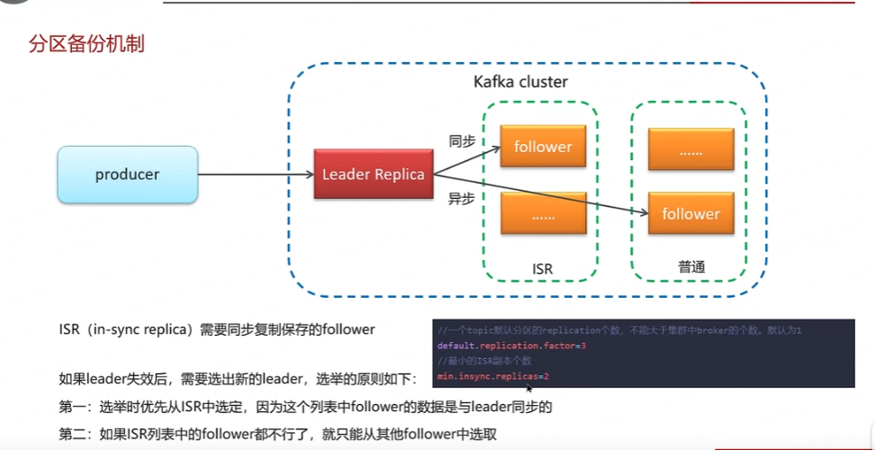

## 分库分表
    1. 垂直分表： 大表拆小表，将表中不经常使用活长度较大的字段拆分到扩展表，通过外键关联
    2. 垂直分库： 按照业务模块划分不同的数据库，而不是将数据库表都放在同一个库中
    3. 水平分表：也成为横向分表，将表中不同的数据按照一定规律分布到不同的数据库表中，降低单表的数据量，但是本质上这些表保存在同一库中，所以库级别还是会有io瓶颈
    4. 水平分库分表：水平分库分表与上面讲到的水平分表思路相同，唯一不同就是将这些拆分出来的表保存在不同的数据库中

## MYSQL解决主从延迟
    1. 将配置sync_binlog设置成0或者关闭binlog,innodb_flushlog 也可以设置为 0 来提高 sql 的执行效率。 就是使用比主库更好的硬件设备作为 slave
    2. 把一台从服务器当作备份使用， 而不提供查询， 这样他的负载就下来了， 执行 relay log 里面的 SQL 效率自然就高了.
    3. 增加从服务器，这个目的还是分散读的压力， 从而降低服务器负载

## 什么时候触发full gc
    1. 当新创建的对象无法在堆内存中分配空间时，就会触发full gc
    2. 如果年轻代区域满了，老年代还没有足够的空间存储新的对象，会触发full gc
    3. 调用System.gc()方法，不推荐使用，显式请求GC，对性能产生负面影响
    4. 空间分配担保失败： 1.每次晋升的对象的平均大小 > 老年代剩余空间  2.Minor GC后存活的对象超过了老年代剩余空间

## Springboot自动配置原理
    1. 在SpringBoot项目中的引导类上有一个注解@SpringBootApplication,这个注解是对三个注解进行了封装,分别是:
       @SpringBootConfiguration
       @EnableAutoConfiguration
       @ComponentScan
    2. 其中@EnableAutoConfiguration是实现自动化配置的核心注解。该该注解通过@Import注解导入对应的配置选择器。内部就是读取了该项目和该项目引用的Jar包的的classpath
       路径下META-INF/spring.factories文件中的所配置的类的全类名。在这些配置类中所定义的Bean会根据条件注解所指定的条件来决定是否需要将其导入到Spring容器中。
    3. 条件判断会有像@ConditionalOnClass这样的注解,判断是否有对应的class文件,如果有则加载该类,把这个配置类的所有的Bean放入spring容器中使用。

## Spring Cloud 5大核心组件
    # 1. Netflix Eureka: 服务注册与发现
    # 2. Netflix Ribbon: 负载均衡
    # 3. Netflix Hystrix: 服务熔断
    # 4. Gateway/Zuul: 网关
    # 5. Config: 配置中心

## Nacos和Eureka的区别
### Nacos与eureka的共同点(注册中心)
      1. 都支持服务注册和服务拉取
      2. 都支持服务提供者心跳方式做健康检测
### Nacos与Eureka的区别(注册中心)
      1. Nacos支持服务端主动检测提供者状态:临时实例采用心跳模式,非临时实例采用主动检测模式
      2. 临时实例心跳不正常会被剔除,非临时实例则不会被剔除
      3. Nacos支持服务列表变更的消息推送模式,服务列表更新更及时
      4. Nacos集群默认采用AP方式,当集群中存在非临时实例时,采用ICP模式;Eureka采用AP方式
      5. Nacos还支持了配置中心,eureka则只有注册中心,也是选择使用nacos的一个重要原因
      6. Nacos支持AP和CP模式，Eureka只支持AP模式
      7. Nacos支持服务的配置管理和服务的发现，Eureka只支持服务的发现
      8. Nacos支持服务的集群，Eureka不支持服务的集群
      9. Nacos支持服务的健康检查，Eureka不支持服务的健康检查
      10. Nacos支持服务的权重设置，Eureka不支持服务的权重设置
      11. Nacos支持服务的路由管理，Eureka不支持服务的路由管理
      12. Nacos支持服务的限流控制，Eureka不支持服务的限流控制
      13. Nacos支持服务的降级，Eureka不支持服务的降级
      14. Nacos支持服务的熔断，Eureka不支持服务的熔断
      15. Nacos支持服务的监控，Eureka不支持服务的监控

## CAP理论和BASE理论
    1. CAP理论: 一个分布式系统不可能同时满足一致性(Consistency),可用性(Availability)和分区容错性(Partition tolerance)。因此,根据CAP原理将NoSQL数据库分成了满足CA原则、满足CP原则和满足AP原则三大类
    2. BASE理论: BASE是Basically Available(基本可用),Soft state(软状态)和Eventually consistent(最终一致性)三个短语的缩写。BASE理论是对CAP中一致性和可用性权衡的结果,
       其来源于对大规模互联网系统分布式实践的总结,是基于CAP定理逐步演化而来的,它大大降低了我们对系统的要求,即使无法做到强一致性, 但每个应用都可以根据自身的业务特点,采用适当的方式来使系统达到最终一致性

## 你们采用哪种分布式事务解决方案? 描述项目中采用的哪种方案(seata|MQ)
    1.seata的XA模式,CP,需要互相等待各个分支事务提交,可以保正强一致性,性能差
    2.seata的AT模式,AP,底层使用undolog实现,性能好
    3.seata的TCC模式,AP,性能较好,不过需要人工编码实现
    4.MQ模式实现分布式事务,在A服务写数据的时候,需要在同一个事务内发送消息到另外一个事务 ,异步,性能最好

## 接口幂等性解决方案
    1. 数据库唯一索引
    2. redis + token机制
    3. 分布式锁

# MQ问题
## 如何保证消息不丢失
    1. 生产者确认机制：RabbitMQ提供了publisher confirm机制来避免消息发送到MIQ过程中丢失。消息发送到MQ以后,会返回一个结果给发送者,表示消息是否处理成功
    2. 消息持久化： MQ默认是内存存储消息，开启持久化功能可以确保缓存在MQ中的消息不丢失
    3. 消费组确认机制： RabbitMQ支持消费者确认机制,即:消费者处理消息后可以向MQ发送ack回执,MQ收到ack回执后才会删除该消息
    4. 消息重试机制： RabbitMQ支持消息重试机制,即:消费者在处理消息时,如果发生异常,可以将消息重新放回到MQ中,供其他消费者消费
## 答案模板
     面试官:RabbitMQ-如何保证消息不丢失
     候选人:嗯!我们当时MYSQL和Redis的数据双写一致性就是采用RabbitMQ实现同步的,这里面就要求了消息高可用性,我们要保证消息的不丢失。主要从三个层面考虑
        第一个是开启生产者确认机制,确保生产者的消息能到达队列,如果报错可以先记录到日志中,再去修复数据
        第二个是开启持久化功能,确保消息未消费前在队列中不会丢失,其中的交换机、队列、和消息都要做持久化
        第三个是开启消费者确认机制为auto,由spring确认消息处理成功后完成ack,当然也需要设置一定的重试次数,
        我们当时设置了3次,如果重试3次还没有收到消息,就将失败后的消息投递到异常交换 机,交由人工处理

## 消息持久化
    1. 将交换机持久化
    2. 将队列持久化
    3. 将队列绑定到交换机持久化
    4. 将消息持久化

## 消息失败之后如何处理呢？
    1. 回调方法立即重发
    2. 记录日志
    3. 保存到数据库后定时重发，成功发送后即刻删除表中数据

## 消息重复消费如何解决
    1. 业务层面幂等性设计
    2. 数据库唯一索引
    3. redis + token机制
    4. 分布式锁
## RabbitMQ中的死信交换机
     延迟队列 = 死信交换机+死信队列+TTL
## 死信交换机
    1. 死信交换机是一个普通的交换机,它和普通的交换机没有什么区别,只是在使用的时候需要注意一下
    2. 死信交换机的作用是用来接收死信队列中的消息,然后将消息转发到其他的队列中去
    3. 死信交换机的类型可以是direct、topic、fanout、headers
## RabbitMQ有百万消息堆积, 如何解决？
    1. 增加更多消费者，提高消费速度
    2. 在消费者内开启线程池加快消息处理速度
    3. 扩大队列容积， 提高堆积上限, 采用惰性队列
## 答案模版
    面试官:如果有100万消息堆积在MQ,如何解决?
    候选人:
    我在实际的开发中,没遇到过这种情况,不过,如果发生了堆积的问刷题,解决方案也所有很多的
    第一:提高消费者的消费能力,可以使用多线程消费任务
    第二:增加更多消费者,提高消费速度
    使用工作队列模式,设置多个消费者消费消费同一个队列中的肖息
    第三:扩大队列容积,提高堆积上限
    可以使用RabbitMQ情性队列,情性队列的好处主要是
    1接收到消息后直接存入磁盘而非内存
    2消费者要消费消息时才会从磁盘中读取并加载到内存
    3支持数百万条的消息存储

## 惰性队列
    1.接收到消息后直接存入磁盘而非内存
    2.消费者要消费消息时才会从磁盘中读取并加载到内存
    3.支持数百万条的消息存储
    在声明队列的时候可以设置属性x-queue-mode为lazy,即为惰性队列
    基于磁盘存储,消息上限高
    性能比较稳定,但基于磁盘存储,受限于磁盘IO,时效性会降低

## RabbitMQ的高可用机制有了解过嘛
     在生产环境下,我们当时采用的镜像模式搭建的集群,共有3个节点
     镜像队列结构是一主多从(从就是镜像),所有操作都是主节点完成,然后同步给镜像节点
     主宕机后,镜像节点会替代成新的主(如果在主从同步完成前,主就已经宕机,可能出现数据丢失)
     那出现丢数据怎么解决呢?
     我们可以采用仲裁队列,与镜像队列一样,都是主从模式,支持主从数据同步,主从同步基于Raft协议,强一致。
     并且使用起来也非常简单,不需要额外的配置,在声明队列的时候只要指定这个是仲裁队列即可
## 答案模版
    面试官:RabbitMQ的高可用机制有了解过嘛
    候选人:嗯,熟悉的~
    我们当时项目在生产环境下,使用的集群,当时搭建是镜像模优集群,使用了3台机器。
    镜像队列结构是一主多从,所有操作都是主节点完成,然后同步给镜像节点,如果主节点宕机后,镜
    像节点会替代成新的主节点,不过在主从同步完成前,主节点就已经宕机,可能出现数据丢失
    面试官:那出现丢数据怎么解决呢?
    候选人:
    我们可以采用仲裁队列,与镜像队列一样,都是主从模式,支诗主从数据同步,主从同步基于Raft协议,强一致。
    并且使用起来也非常简单,不需要额外的配置,在声明队列的时候只要指定这个是仲裁队列即可

# Kafka消息队列问题
## 如何保证消息不丢失
    1. 生产者发送确认机制acks
       acks=0: 生产者不需要等待任何确认消息,消息有丢失风险，但是速度最快
       acks=1: 生产者只需要等待集群中的leader节点确认消息,速度和安全性都有保证
       acks=all: 生产者需要等待ISR中所有的副本节点都确认消息,速度最慢,但是安全性最高
    2. 消费者消费确认机制
      禁用自动提交偏移量，改为手动提交
      同步提交: 消费者在消费完消息后,手动调用commitSync()方法提交偏移量,如果提交失败,会一直重试,直到提交成功
      异步提交：消费者在消费完消息后,手动调用commitAsync()方法提交偏移量,如果提交失败,不会重试,会继续消费下一条消息
      同步+异步提交: 消费者在消费完消息后,先异步提交偏移量,如果提交失败,会一直重试,直到提交成功,然后再同步提交偏移量

## kafka是如何保证消费的顺序性
    1. 问题原因：一个topic的数据可能存储在不同的分区中,每个分区都有一个按照顺序的存储的偏移量,如果消费者关联了多个分区不能保证顺序性
    2. 解决方案：1. 发送消息指定分区号 2.发送消息时指定key,然后根据key的hash值与分区数取模得到分区号 3.消费者只订阅一个分区

    ## kafka的高可用机制

## Kafka的高可用机制有了解过嘛
    可以从两个层面回答,第一个是集群,第二个是复制机制
    集群: 一个kafka集群由多个broker实例组成,即使某一台宕机,也不耽误其他broker继续对外提供服务
    复制机制: 一个topic有多个分区,每个分区有多个副本,有一个leader,其余的是follower,副本存储在不同的broker中
           所有的分区副本的内容是都是相同的,如果leader发生故障时,会自动将其中一个follower提升为leader,保证了系统的容错性、高可用性
## 解释一下复制机制中的ISR
    ISR(in-sync replica)需要同步复制保存的follower 分区副本分为了两类,一个是ISR,与leader副本同步保存数据,另外一个普通的副本,
    是异步同步数据,当leader 挂掉之后,会优先从ISR副本列表中选取一个作为leader

## kafka数据清理机制
    Kafka存储结构
    Kafka中topic的数据存储在分区上,分区如果文件过大会分段存诸segment
    每个分段都在磁盘上以索引(xxxxx.index)和日志文件(xxxxx.log)的形式存储
    分段的好处是,第一能够减少单个文件内容的大小,查找数据方便,第二二方便kafka进行日志清理。
    日志的清理策略有两个:
    根据消息的保留时间,当消息保存的时间超过了指定的时间,就会触发清理,默认是168小时(7天)
    根据topic存储的数据大小,当topic所占的日志文件大小大于一定的阈值,则开始删除最久的消息。(默认关闭)
## Kafka中实现高性能的设计
    消息分区:不受单台服务器的限制,可以不受限的处理更多的数据
    顺序读写:磁盘顺序读写,提升读写效率
    页缓存:把磁盘中的数据缓存到内存中,把对磁盘的访问变为对内存的访问
    零拷贝:减少上下文切换及数据拷贝
    消息压缩:减少磁盘IO和网络IO
    分批发送:将消息打包批量发送,减少网络开销

